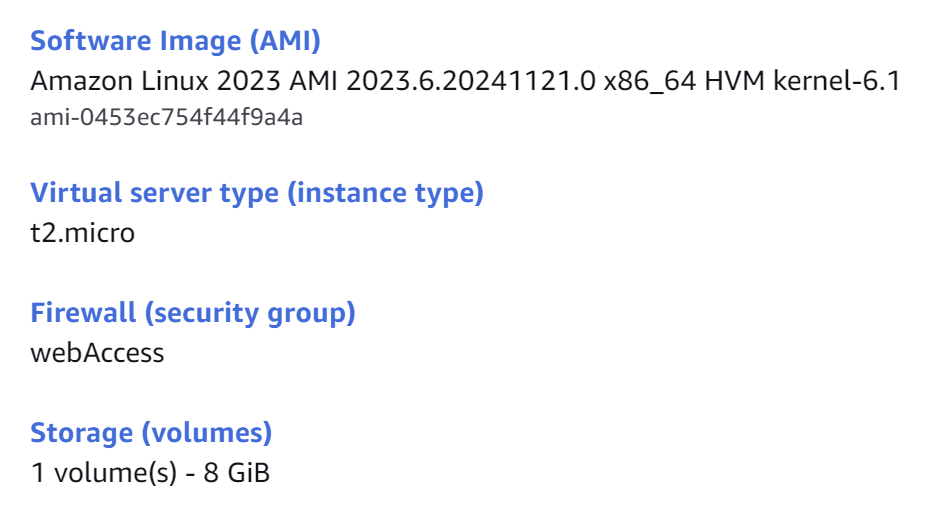
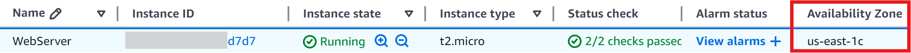
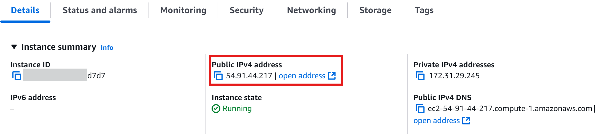
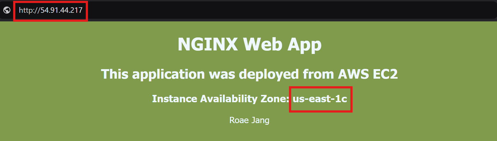

This project demonstrates how to deploy a web application on a Linux-based AWS EC2 instance. While there are several ways to publish a web application, it focuses on using `User data` to automate the setup. By leveraging user data, we can streamline the configuration process, allowing the instance to perform initial setup tasks automatically during boot.

* *Prerequisites*
	1. AWS account (preferably **IAM admin user**)
	2. Simple HTML code for static website

# Create AWS EC2 instance

Since this project has modest resource requirements, I have selected a minimum-level instance. Despite its low resource allocation, this instance is more than capable of efficiently serving the web application. Default settings are applied during the instance initialization process.

## Basic components
- AMI: `Amazon Linux` - maximize efficiency, minimize power resources
- Type: `t2.micro` - free tier, perfect for small project
- Firewall (security group): Create with the default settings

Instance summary:


## Additional configuration
###  Firewall: Configure a `security group` for public access
- Add an inbound rule to allow traffic from public users
- Ensure the `HTTP/HTTPS` protocols are enabled, as they are essential for initiating and maintaining web services *(HTTP is used to support this non-production project)*

**Inbound rule**
- Type: **HTTP** provides `request-response` service on a web browser between `client-server`
- Protocol: **TCP** ensures reliable data transmission
- Port: **80** port number designated for HTTP
- Source: **0.0.0.0/0** indicates `any` IP addresses (all range)

## Writing a User Data
User data is a powerful feature in AWS allows to automate tasks during the initialization of an EC2 instance. By providing a shell script in the User Data field, we can:
- Automate repetitive setup tasks, reducing manual intervention.
- Configure and prepare the instance during its boot process, saving time.
- Ensure the instance is ready to serve its purpose immediately after launch.

Below is the shell script that automates the tasks required to run a web server. Insert the script as a file (`.sh`) or as a text in the box.

```bash
# Part 1. System Update & Installation
# Ensure the system is up to date and installs web server (Nginx).
# After updates, start and enable the Nginx service.

#!/bin/bash

# Escalate to admin user
sudo su

# Update and install system package
yum update -y
yum install nginx

# Start the web server
systemctl start nginx
systemctl enable nginx

# Confirm the web service starts on boot
chkconfig nginx on

# Part 2. Retrieving AWS Metadata
# Retrieves AWS instance metadata for live demonstration.
# Extract and save instance's `availability zone` as a variable- AZ.

# Retrieve metadata of the instance
TOKEN=`curl -X PUT "http://169.254.169.254/latest/api/token" -H "X-aws-ec2-metadata-token-ttl-seconds: 21600"`
AZ=`curl -H "X-aws-ec2-metadata-token: $TOKEN" http://169.254.169.254/latest/meta-data/placement/availability-zone`

# Part 3. Create a Web Page File
# Create an `index.html` file as a default landing page.

# Create a web page file in .html
cat > /usr/share/nginx/html/index.html <<EOF
<!DOCTYPE html>
<html>
<head>
  <meta charset="utf-8">
  <title>WebApp | Rose</title>
  <style>
    body {
      color: #f0f8ff;
      background-color: #809b4c;
      font-family: Tahoma, Verdana, Arial, sans-serif;
    }
  </style>
</head>
<body>
  <div align="center">
    <h1>NGINX Web App</h1>
    <h2>This application was deployed from AWS EC2</h2>
    <h3>Instance Availability Zone: $AZ</h3>
    <p>Rose Jang</p>
  </div>
</body>
</html>
EOF
```


# Run the instance & Web server

Using the user data script, we pre-configured everything necessary for the web server: 
- Installed and configured the web server
- Started and enabled the web server
- Created and saved an `index.html` file to server as the landing page

Now it's time to test the web server by launching the instance and verifying that it is running successfully.

## Launching the Instance
Double-check the instance settings and the shell script correctly saved in user data. Also ensure that the Security Group has an inbound rule allowing `http` traffic (port 80) to enable public access to the web server.

## Locate the Instance Details
Once the instance is running, navigate to the `Details` section to check its status and availability zone. This will be used to verify if the metadata is correctly passed in the script. Locate the **public IP address** to access the web server. Ensure the instance is in a "Running" state and that all health checks have passed before proceeding.

Instance details
- ID: ending with **d7d7**
- Availability Zone: **us-east-1c**
- Public IP address: **54.91.44.217**





## Test the Web Server
Access the public IP address in a web browser using `http` protocol. 
`(ex. http://54.91.44.217)`
Confirm that the Nginx web server is running and the landing page matches the content of the `index.html` file.


### *TIP!*
If the web server is not running or there are any issues, check the log file for details.
The log file provides detailed information about the execution of the user data script and helps troubleshoot any errors or misconfigurations.
```
cat /var/log/cloud-init-outpug.log
```


# Conclusion

This project successfully demonstrated how to deploy a web application on an AWS EC2 instance using Nginx. Utilizing `User data` reduces time on initializing core configurations including web server installation, setup, and deployment of a static landing page. This streamlined approach highlights the efficiency and flexibility of cloud infrastructure for hosting a web application.