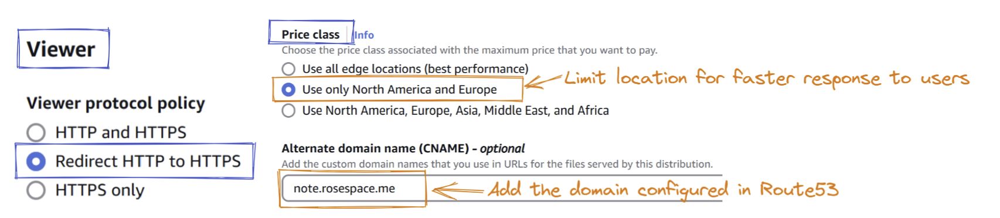

# Project Overview

In this project, I built a simple **note-taking web app** that features a clean and minimalistic design, providing a user-friendly interface for taking quick notes. To make the app accessible to users on the web, I hosted it using AWS (Amazon Web Services), specifically using **Amazon S3 for static website hosting** and **Route 53 for domain management**. By deploying the app on AWS, we can ensure that it is scalable, secure, and easily accessible.

* *Prerequisites*
	1. AWS account (preferably **IAM admin user**)
	2. Note-Taking Website files (Check out this repo- [Link](https://github.com/rose-jang/web-takenote))
	3. Domain name

# Used AWS Services

To maximize the functionality of the web application, several AWS services were utilized in this project. These services enhance security, availability, and user accessibility on the front end while ensuring efficient management and cost-effectiveness on the back end.

- **S3** (Simple Storage Service)
- **Route 53** (for Domain Name Service)
- **CloudFront** (as Content Network Delivery)
- **AWS Certificate Manager** (to activate HTTPS)

---

## Content management on **S3**

Amazon **S3 (Simple Storage Service)** is a highly scalable object storage service that allows us to store and manage virtually unlimited amounts of data. It is particularly useful for hosting static websites, including HTML, CSS, JS, images, and other files.

### Setting Up Bucket
1. Create a bucket
	- Create a general bucket with a globally unique name
	- Leave other settings as default


2. Upload files
	- After the bucket is created, simply drag & drop files into the bucket


### Configuration
After uploading the website files, we need to configure the bucket for static website hosting.


1. **Properties**
- Enable **Static website hosting**
	- Hosting type: **Static website**
	- Index document: **index.html** (landing page)
	- Keep other settings as default


2. **Permissions**
- Turn off **Block all public access**, which will allow the bucket to be publicly accessible
- Edit **Bucket policy** as below, in **JSON** format (*Use your bucket ARN as **Resource***)
```json
{
  "Version": "2012-10-17",
  "Statement": [
    {
      "Sid": "PublicReadGetObject",
      "Effect": "Allow",
      "Principal": "*",
      "Action": "s3:GetObject",
      "Resource": "arn:aws:s3:::note.rosespace.me/*"
    }
  ]
}
```

3. Verify **Accessibility**
- In **Properties**, scroll down to the **Bucket website endpoint**
- The endpoint displays the bucket objects as a static website


---
## Domain name setup with **Route 53**

Now that the website is hosted on S3, we can set up a custom domain using **AWS Route 53** to make the site more user-friendly and accessible.
### Create a DNS Record
1. Access to **Route 53**, and select your domain
2. Under **Records**, click **Create record**


3. Configure the **CNAME** record (subdomain)
	- Record name: **Name the website** as you want
	- Record type: **CNAME** (Canonical Name)
	- Value: Enter the **website endpoint** retrieved from the bucket


4. **Check Accessibility**
	- Once the DNS record is created, try accessing the domain
    - If everything is configured correctly, the website should be up and running without issues


---
## **CloutFront**

To further enhance the speed, security, and global accessibility of the website, let's deploy a **CloudFront** distribution and issue a a public SSL/TLS certifiacate via **ACM, AWS Certificate Manager**.

### Initialize CloudFront Distribution
1. Create a distribution
	- Navigate to **CloudFront** and create a new **distribution**
	- Choose the **S3 bucket** (static website endpoint) as the origin domain
	- Ensure the **bucket name** and **custom domain name** match for routing


2. Distribution configuration
	- Configure further for proper access
	- Viewer: Redirect **HTTP to HTTPS**
	- Price class: Select desired **regions**
	- Alternate domain name: Add the **domain name** configured previously



3. Request a certificate
	- If you don't have one yet, request a new public certificate
	- Fully qualified domain name: Enter the **FQDN**
	- Validation method: **DNS validation**


	- Confirm the certificate status and return to the distribution setup
	- Select the new certificate from the list
	- Complete the distribution creation process


4. Edit Route 53 CNAME record
Once the distrubution is deployed and enabled:
	- Go to **Route 53** and edit the existing **CNAME** record
	- Replace the value with the distribution domain name


5. Verify Website Accessibility
If everything is configured correctly and running, you can now access the secure website.
The website is now:
	- Globally distributed via **CloudFront**
	- Securely accessible with **HTTPS** via the ACM-issued cerficicate
	- Properly routed through the custom domain name


---
## Conclusion

By integrating AWS S3, Route 53, CloudFront, and ACM, we successfully hosted a static web application with a robust and modern infrastructure. The website is not only highly available and securely accessible via HTTPS, but also globally distributed with low latency and reachable through a custom domain. This setup ensures a smooth and reliable user experience while taking full advantage of AWS’s scalability, performance, and cost-effectiveness.