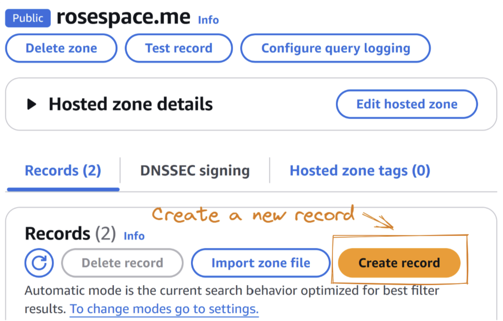

# Project Overview

In this project, I built a simple **note-taking web app** that features a clean and minimalistic design, providing a user-friendly interface for taking quick notes. To make the app accessible to users on the web, I hosted it using AWS (Amazon Web Services), specifically using **Amazon S3 for static website hosting** and **Route 53 for domain management**. By deploying the app on AWS, we can ensure that it is scalable, secure, and easily accessible.

* *Prerequisites*
	1. AWS account (preferably **IAM admin user**)
	2. Note-Taking Website files (Check out this repo- [Link](https://github.com/rose-jang/web-takenote))
	3. Domain name

# Used AWS Services

To maximize the functionality of the web application, several AWS services were utilized in this project. These services enhance security, availability, and user accessibility on the front end while ensuring efficient management and cost-effectiveness on the back end.

- **S3** (Simple Storage Service)
- **Route 53** (for Domain Name Service)
<!-- - **CloudFront** (as Content Network Delivery)
- **AWS Certificate Manager** (to activate HTTPS) -->

---

## Content management on **S3**

Amazon **S3 (Simple Storage Service)** is a highly scalable object storage service that allows us to store and manage virtually unlimited amounts of data. It is particularly useful for hosting static websites, including HTML, CSS, JS, images, and other files.

### Create bucket
1. Create a bucket
	- Create a general bucket with a globally unique name
	- Leave other settings as default


2. Upload files
	- After the bucket is created, simply drag & drop files into the bucket


### Configuration
After uploading the website files, we need to configure the bucket for static website hosting.


1. **Properties**
- Enable **Static website hosting**
	- Hosting type: **Static website**
	- Index document: **index.html** (landing page)
	- Keep other settings as default


2. **Permissions**
- Turn off **Block all public access**, which will allow the bucket to be publicly accessible
- Edit **Bucket policy** as below, in **JSON** format (*Use your bucket ARN as **Resource***)
```json
{
  "Version": "2012-10-17",
  "Statement": [
    {
      "Sid": "PublicReadGetObject",
      "Effect": "Allow",
      "Principal": "*",
      "Action": "s3:GetObject",
      "Resource": "arn:aws:s3:::note.rosespace.me/*"
    }
  ]
}
```

3. Verify **Accessibility**
- In **Properties**, scroll down to the **Bucket website endpoint**
- The endpoint displays the bucket objects as a static website


---
## Domain name setup with **Route 53**

Now that the website is hosted on S3, we can set up a custom domain using **AWS Route 53** to make the site more user-friendly and accessible.
### Create a DNS Record
1. Access to **Route 53**, and select your domain
2. Under **Records**, click **Create record**


3. Configure the **CNAME** record (subdomain)
	- Record name: **Name the website** as you want
	- Record type: **CNAME** (Canonical Name)
	- Value: Enter the **website endpoint** retrieved from the bucket


4. **Check Accessibility**
	- Once the DNS record is created, try accessing the domain
    - If everything is configured correctly, the website should be up and running without issues


## Final Thoughts

By following these steps, we can host a simple static web app using AWS S3 and Route 53. This setup ensures that the website is scalable and easily accessible through a custom domain name. Furthermore, by using AWS services like S3 and Route 53, the application benefits from high availability and low latency, providing a better user experience for visitors.
