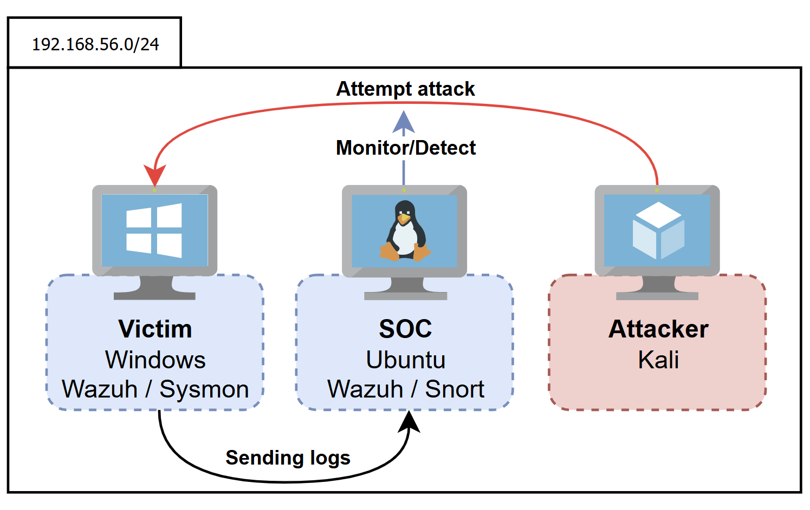
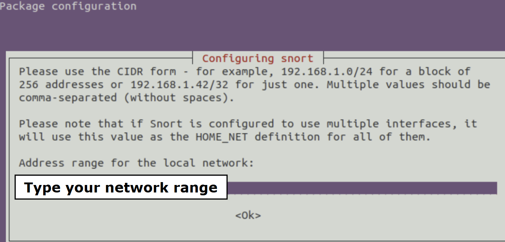
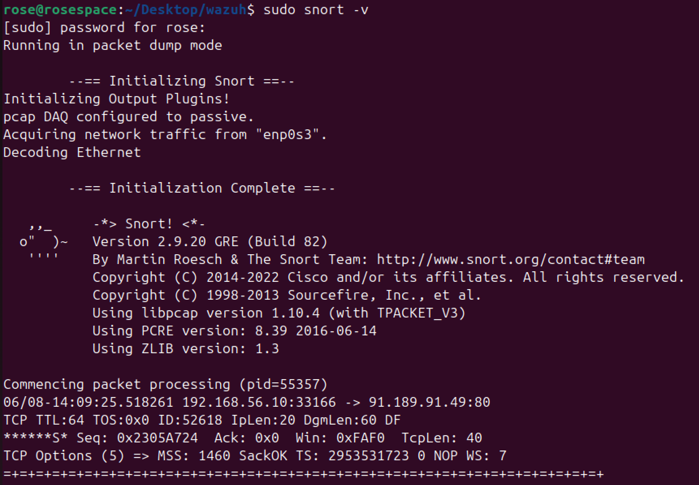
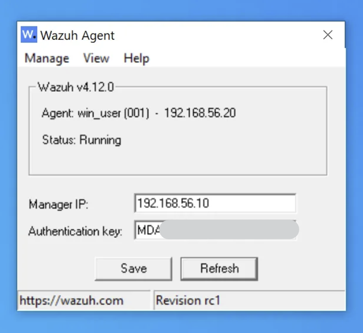
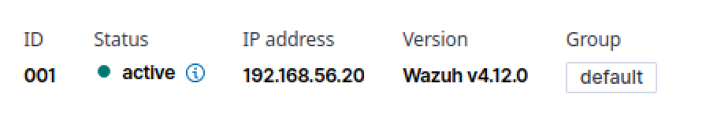

# Introduction

This project simulates a simplified Security Operations Centre (SOC) environment within a small enterprise network. It uses open-source tools including **Wazuh**, **Snort**, and **Sysmon** — to demonstrate how cyberattacks can be detected and monitored in real-time. 

In this post, it focuses on setting up the internal network and essential security tools. Real-world attack scenarios will be excecuted to observe how the SOC components respond in the next post.

By emulating a realistic attack-and-defense scenario, this project aims to deepen understanding of SOC operations and network security monitoring.

# Scenario Overview

The SOC home lab consists of **three virtual machines** running on **VirtualBox**, each serving a different role:

- **Victim**: A **Windows** machine with **Sysmon** and the **Wazuh** agent installed to log and send system activity data.
- **SOC Server**: An **Ubuntu** machine running **Wazuh** (as the SIEM) and **Snort** (as the IDS) to collect, analyze, and alert on suspicious behaviour.
- **Attacker**: A **Kali** Linux machine used to simulate offensive actions, including port scanning and credential dumping using tools like **Nmap** and **Mimikatz**.

> This setup assumes that the attacker already has gained access to the internal network. This reflects post-compromise behaviour for realistic threat emulation.



---

# Environment Setup

## Network configuration

All virtual machines in this lab are connected using a **Host-only network adapter** to ensure isolation from the internet, allowing safe and controlled testing. Each machine is configured with a **static IP address** to simplify traffic analysis and eliminate ambiguity during monitoring.

- **Static IP assignments**:
    - Ubuntu (SOC Server): `192.168.56.10`
    - Windows (Victim): `192.168.56.20`
    - Kali (Attacker): `192.168.56.30`

---

## Tooling & Configuration

## Ubuntu - SOC Server

### SIEM: Wazuh

- **Installation**
    1. Install **Wazuh** **All-in-One** package (from [**Wazuh Quickstart**](https://documentation.wazuh.com/current/quickstart.html)), which includes:
        - Wazuh Manager
        - Filebeat
        - Elasticsearch
        - Kibana
    2. Verify server dashboard access:
        - Server IP: 192.168.56.10, Port 5601
        - URL: `http://[serverIP]:5601`
- **Agent Deployment**
    1. Add an agent from Wazuh dashboard
    2. Troubleshooting for agent deployment on dashboard
        1. Run the agent manager in CLI:
            
             `sudo /var/ossec/bin/manage_agents` 
            
        2. Follow prompts to create an agent
        3. Extract the authentication key of the agent
        4. Enter the key into the Wazuh Agent software on Windows machine
        5. Restart both the agent and server
    3. Confirm the Windows machine appears in the dashboard

### IDS/IPD: Snort

**Quick Note: Difference between IDS/IPS?**

- IDS (Intrusion Detection System) alerts on suspicious activities based on defined rules.
- IPS (Intrusion Prevention System) acts a step further by actively responding to malicious traffics.

- **Installation**
    1. Install in CLI:
        
        `sudo apt-get install snort -y`
        
    2. Define the network range to monitor during installation (e.g., 192.168.56.0/24)


        
    4. Test Snort:
        
        `sudo snort -v`
        

        

- **Configuration**
  - **Snort file path**
    - Configs: **/etc/snort**
    - Logs: **/var/log/snort**
    - Rules: **/etc/snort/rules**
  1. Rule configuration
      - Add ruled into the file > `/etc/snort/rules/local.rules`
      - Alert rule configuration structure
          - Header - Body - Actions
          - alert [protocol] [source] [port]  → [destination] [port] (body… msg:”~~detected”;)
          
      ```bash
      # Detect open port scanning
      alert tcp any any -> $HOME_NET 1:1024 (
        flags: S;
        msg: "PORT SCAN detected";
        threshold: type both, track by_src, count 10, seconds 3;
        sid: 1001; rev: 1;
      )
      
      # Detect Mimikatz
      alert tcp any any -> $HOME_NET any (
        msg: "Mimikatz detected";
        content: "mimikatz"; nocase;
        sed: 1002; rev: 1;
      )
      ```
      
      - Detect open port scanning
          - `flags: S;` # Flags for TCP **SYN**
          - `threshold:` # Triggers when 10 SYN packets in 3 seconds
      - Detect Mimikatz
          - `content:` # Detects a string “mimikatz”, case insensitive
  

---

## Windows - Victim

### Sysmon: Activity logging

- **Installation**
    1. Download Sysmon file on [Microsoft official site](https://learn.microsoft.com/en-us/sysinternals/downloads/sysmon)
    2. Use the configuration file [provided by Wazuh](https://wazuh.com/resources/blog/emulation-of-attack-techniques-and-detection-with-wazuh/sysmonconfig.xml) (save as XML file)
    3. Install via PowerShell:
        
        `./sysmon64.exe -i sysconfig.xml`
        

### Wazuh Agent

- **Installation**
    1. Install by using command retrieved from Wazuh dashboard
    2. Or insert authentication key from Agent management
      > Refer to the [**Agent deployment**](https://www.notion.so/Home-Lab-SOC-Project-Setting-UP-2017754e3fa080a38c38d53645bd9bf0?pvs=21) in **SIEM: Wazuh** section above


  
    3. Confirm logs and events appearing on the Wazuh dashboard




# Conclusion

This post covered the setup of a simplified SOC lab using tools such as Wazuh, Snort, and Sysmon across isolated virtual machines. By isolating the network and configuring static IPs, we created a controlled space for observing attacker behaviors and system responses. With all components successfully deployed and communicating, the foundation is now ready for simulating and detecting real-world cyberattacks.

The simulation using penetration tools on Kali will be demonstrated in the next blog post.
